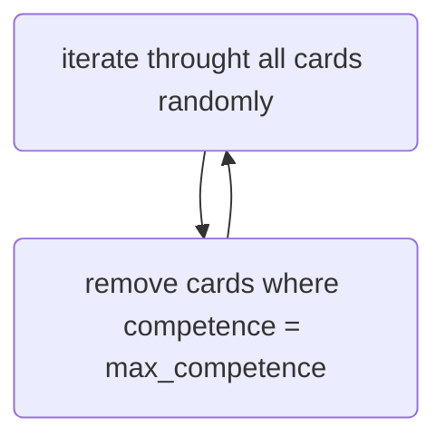

# algorithm for determining when to show which cards

## simple

```mermaid
graph TB
    step_iterate(iterate throught all cards randomly)
    --> step_remove(remove cards where competence = max_competence)
    --> step_iterate
```
